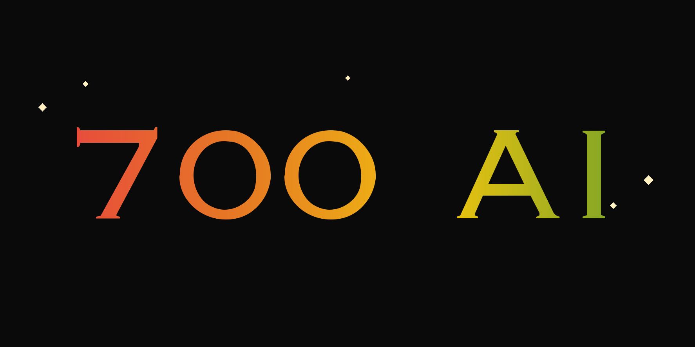
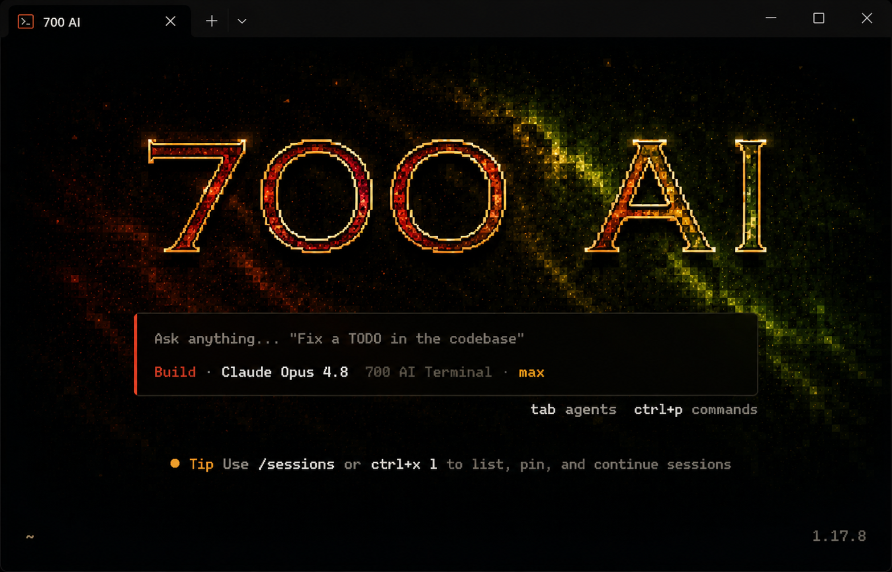

<p align="center">
  
</p>

<p align="center">
  <em>A local AI assistant for your terminal. Any provider, your keys, your machine.</em>
</p>

<p align="center">
  
  
  = 18">
</p>

---

700 AI is a provider-agnostic chat + build REPL. It talks to OpenAI, Anthropic,
OpenRouter, Groq, Mistral, Together, Ollama, or any OpenAI-compatible endpoint —
using **your** API key, stored only on your machine in `~/.700ai`. Nothing you
type leaves your computer except the API calls you make to your chosen provider.

<p align="center">
  
</p>

## Requirements

- Node.js **18 or newer**

## Install

```bash
npm install
npm start        # launches the interactive terminal
```

Or link it as a global command and run `700`:

```bash
npm link
700
```

## First-run setup

On first launch you'll be prompted to configure a provider. Run the guided
wizard any time with:

```bash
700 setup
```

It walks you through:

1. **Provider** — pick a preset (OpenAI, Anthropic, OpenRouter, Groq, Mistral,
   Together, Ollama, or a custom OpenAI-compatible URL).
2. **Model** — choose from the provider's **live model list**, fetched from its
   API (with manual entry as a fallback).
3. **Search** — an optional search provider for search-augmented skills.
4. **Images** — an optional image-generation model.

Your keys and settings are saved to `~/.700ai` with owner-only permissions.

## Commands

```bash
700              # start the interactive terminal (REPL)
700 setup        # run the guided setup wizard
700 --version    # print the version
700 --help       # show usage
```

Inside the REPL, type a message to chat, or use a slash command:

| Command    | What it does                                         |
| ---------- | ---------------------------------------------------- |
| `/skills`  | List all available commands                          |
| `/setup`   | Re-run setup / switch provider                       |
| `/model`   | Switch the active model (live list from your provider) |
| `/search`  | Web-search-augmented answer                          |
| `/build`   | Build an app/site in a live-reloading browser window |
| `/image`   | Generate an image from a prompt                      |
| `/voice`   | Speak text aloud (requires the ElevenLabs plugin)    |
| `/agents`  | Create and manage custom `@name` agents              |
| `/plugins` | Browse and install plugins                           |
| `/wallet`  | Your private earnings wallet                         |
| `/clear`   | Clear the conversation                               |
| `/exit`    | Quit                                                 |

Prompt skills like `/code`, `/review`, `/debug`, `/write`, `/summarize`,
`/translate`, `/plan`, and more steer the model for a specific task. You can
also route a message to a custom agent with `@name your message`.

## Voice (ElevenLabs)

The `/voice` command uses the bundled ElevenLabs plugin for text-to-speech.
It needs an ElevenLabs API key. Provide it via the environment:

```bash
export ELEVENLABS_API_KEY=your_key_here
700
```

Then in the REPL:

```
700 ❯ /voice hello from seven hundred
```

If `ELEVENLABS_API_KEY` isn't set, `/voice` will prompt you for a key and save
it to `~/.700ai` for next time. Synthesized audio plays via your system's
default media player.

## License

Proprietary — all rights reserved. See [`LICENSE`](LICENSE).
